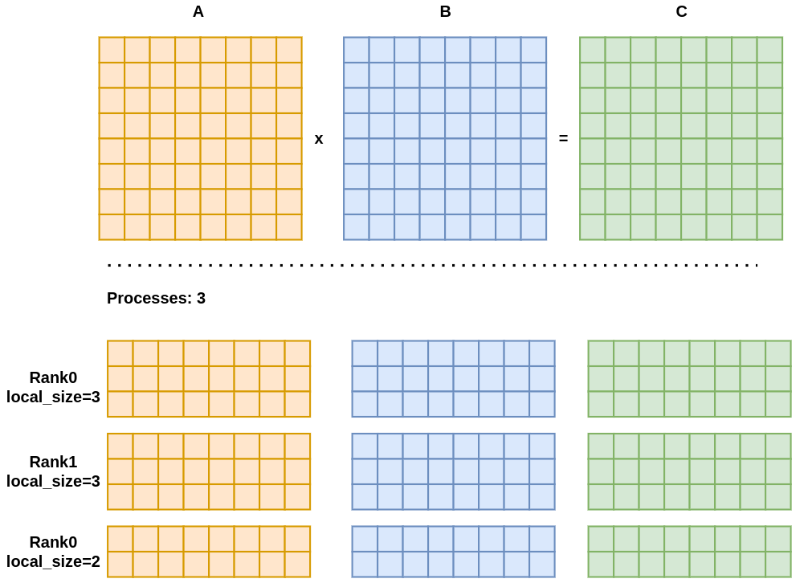
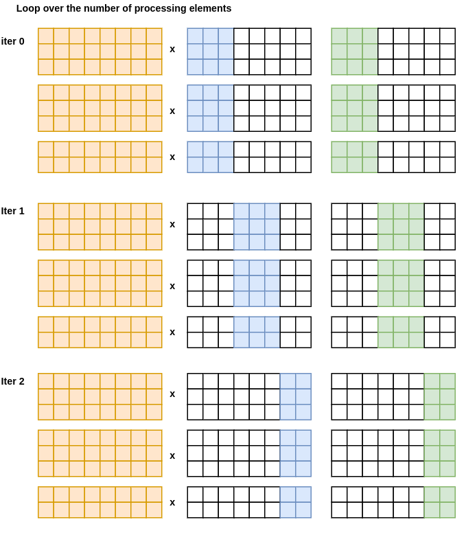
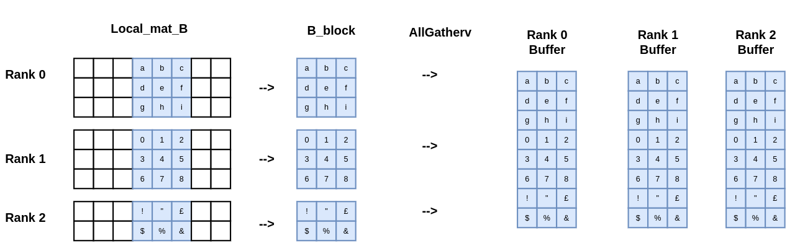
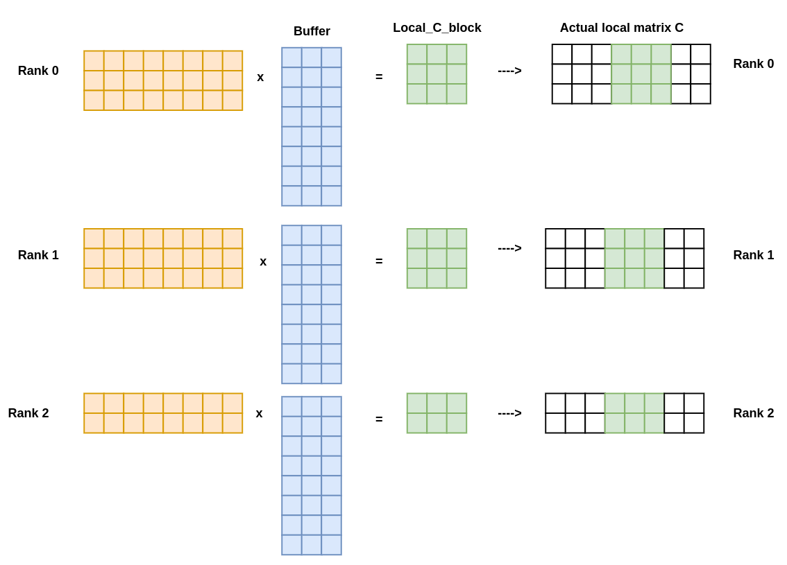

# Distributed Matrix-matrix multiplication

## Table of contents

- [Description](#description)
  * [Main idea](#main-idea)
  * [Implementation details](#implementation-details)
- [How to compile and run the code](#how-to-compile-and-run-the-code)
- [Results](#results)

## Description

### Main idea

In this folder there is the code which implements the distributed matrix-matrix multiplication $A \times B = C$ with $A, B, C$ matrices of size $N \times N$.

All the matrices are distributed among the processing elements as represented in the following figure:

<figcaption>Figure 1: Example of 3 matrices of size 8x8 distributed among 3 processing elements</figcaption>

The main idea is performing a `for` loop cycle over the number of processing elements, and at each iteration, gathering a block of columns of the matrix $B$ in order to compute the local portion of the matrix $C$.

<figcaption>Figure 2: Representation of the main loop of the algorithm. Since both the size of the matrix and the number of processing can be anything, the number of elements in each block that is gathered can be different.</figcaption>

<figcaption>Figure 3: Representation of how each process extract its own portion of the matrix B, and how it is passed to all the other processes with an AllgatherV operation and stored in a buffer.</figcaption>

<figcaption>Figure 4: During the computation of the local portion of the matrix C, each process first compute the block of the global result. Then it is copied to the proper memory location in the global matrix C.</figcaption>

Main loop schema:

for( count 0 -> npes ){

     //Create the contiguos block of data B_block from the local matrix B
     create_B_block( B, B_block)

     //All_gather to collect in all processes the clock of colums of B
     MPI_All_gather(B_block, ...., B_col, ...)

     //Perform the matmul on local data and compute the related C_clock 
     matmul( A, B_col, C_block)
}

