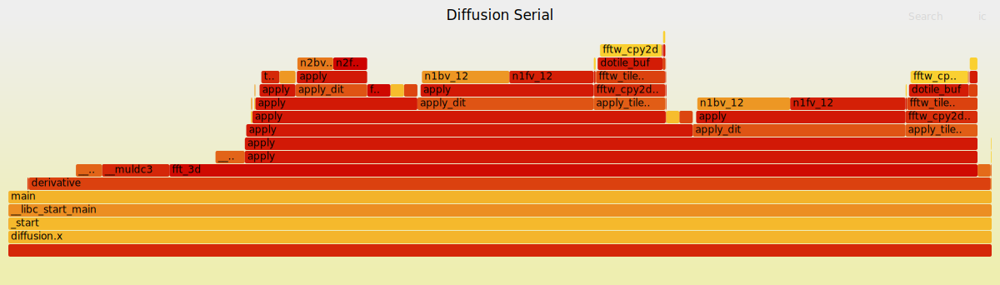
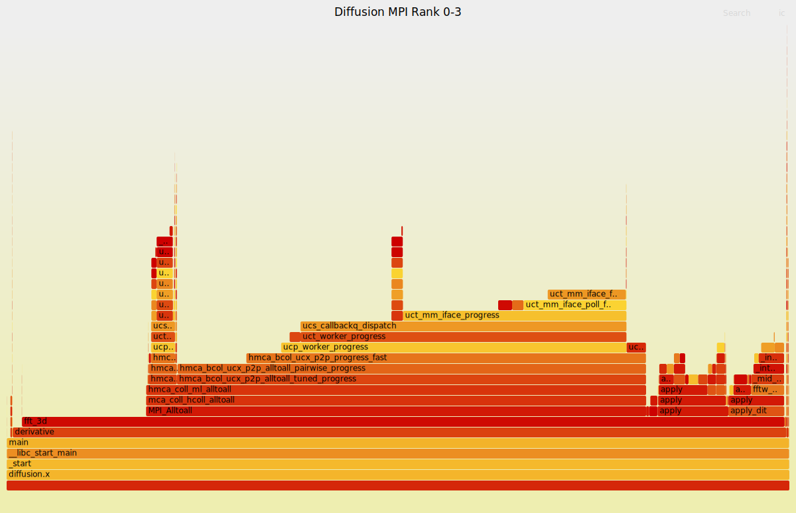

### Profiling using `perf` with Flame Graphs for visualization 

- In performance analysis, one of the routine task is to determine why CPU is busy. To answer this question do a profiling of stack traces. 
- A stack trace is just list of function calls that were active when something happened. It is like a snapshot of the program's call stack at a specific moment in time. 

- `perf record` command can capture a population of stack traces with the (`-g`) option enabled.

- It works by doing a timed iterrupt that collects the current program counter, function address, stack traces and translate this into something human readable. 

- `perf record -F 999 -g ./a.out` you tell the kernel “Every 1/999 seconds, interrupt the CPU and take a snapshot of what the program is doing.
- at each iterrupt the kernel asks: 
    - what instruction is currently executing? 
    - what is the call stack that led to this instruction?
    - “Who called it?”
    - “Which function am I in?”
    - This is one perf sample 

- Profile by sampling at a fixed rate 
   - coarse but effective to see which code paths are hot. 

- `perf report` summarize hundreds of stack trace samples as text. Similar code paths are coalesed and summary is shown as a tree graph. Can be very daunting to read or difficult to comprehend.    

- Enter Flame graphs 

- a tool for visualiazing stack traces and breakdown execution time in profiled applications.


- We use Flame graphs to visualize profiling data collected by a profiler such as `perf`. Flame graphs help identify performance bottlenecks in applications by displaying stack traces in a visually intuitive manner.

- `x`- axis shows the stack profile population, sorted alphabetically. 
- `y`- axis shows the stack depth. 
- each reactangle represents a stack frame. 
- the wider a stack frame the more often it was present on in the stacks. 
- top edge shows whats on the CPU and beneath it is its ancestry. 

What we need:
1. A linux environment (Leonardo, local machine running on Linux, etc.) 
2. perf
3. Flame graph implementation from Brendan Gregg's [repo](https://github.com/brendangregg/FlameGraph). 
```bash 
git clone git@github.com:brendangregg/FlameGraph.git
```
4. Some codes to profile. 

##### Case 1: Profile the diffusion equation solver (single process, serial version).  
 

1. Allocate resources for an interactive session on Leonardo. 
```bash
srun -A ICT25_MHPC -p dcgp_usr_prod -N1 -n4 --cpus-per-task=1 --mem=0g --gres=tmpfs:300g --time=01:00:00 --pty bash
``` 

2. Add the directory containing FlameGraph scripts to your PATH: 
```bash
export PATH=$PATH:/leonardo/home/userexternal/ctica000/MS_thesis/FlameGraph
``` 
3. Navigate to the directory containing the diffusion equation solver serial version code.
- Load the necessary modules.  
```bash
module load fftw/3.3.10--openmpi--4.1.6--gcc--12.2.0-spack0.22
``` 
- wipe out previous build artifacts and recompile with  `-g` and `-fno-omit-frame-pointer`. 
```bash 
make distclean 
```
- Build the code. 
```bash
make -j
``` 
The Makefile used is as follows:
```bash   
CC = gcc
CFLAGS = -O3 -g -Wall -fno-omit-frame-pointer -I$(FFTW_INC)
LIBS = -L$(FFTW_LIB) -lfftw3 -lm

EXE  = diffusion.x           
SRC  = diffusion.c plot_data.c fft_wrapper.c derivative.c
HEAD = utilities.h           
OBJ  = $(SRC:.c=.o)          

all: $(EXE)

$(EXE): $(OBJ)
  $(CC) $(OBJ) $(LIBS) -o $@

%.o: %.c $(HEAD)             
  $(CC) $(CFLAGS) -c $< -o $@

run: $(EXE)
  ./$(EXE)

# Clean generated data/ and frames/, plus common artifacts
flush:
  @rm -f data/concentration_*.dat data/1d_conc_*.dat data/diffusivity_*.dat || true
  @rm -rf frames_2d || true
  @rm -f flame*.svg out.folded perf.data* *.gif *.png || true

clean:
  @rm -f *.o *.x *~ core core.* vgcore.*
                                                                                                                                                                                                                
distclean: clean flush
``` 
4. Run `perf record` to collect profiling data. 
```bash
perf record --delay 10 -F 999 -g --call-graph dwarf -e cycles:u,instructions:u -- ./diffusion.x
``` 
- the option `--delay 10` gives a delay of 0.01 seconds before starting the profiling. This is useful to avoid capturing initialization overhead.
- the option `-F 999` sets the sampling frequency to 999 Hz.
- the option `-g` enables call graph (stack trace) recording 
- the option `--call-graph dwarf` specifies to use DWARF debugging information for call graph generation. 
- the option `-e cycles:u,instructions:u` specifies the events to monitor: CPU cycles and instructions in the user space as opposed to the kernel space. 
- you can add the option `--output=$OUTFILE` to specify the name of the output file and the directory in which to save it. In production scenarios, these files can go as high as several tens of GBs. Use `$SCRATCH` on Leonardo to avoid filling up your home directory.  

- more information about `perf` can be found [here](https://perfwiki.github.io/main/)

5. This generate the file `perf.data` in the working directory. Next, we need to convert this data into a format suitable for generating flame graphs. We use the `perf script` command to do this: 
```bash
perf script -i perf.data > out.perf
```
- the option `-i perf.data` specifies the input file. 
6. Next, we use the `stackcollapse-perf.pl` script from the FlameGraph repository to collapse the stack traces: 
```bash
stackcollapse-perf.pl out.perf > out.folded
```
Steps 5 and 6 can be combined to avoid generating the intermediate `out.perf` file: 
```bash
perf script -i perf.data | stackcollapse-perf.pl > out.folded
```
7. Finally, we generate the flame graph using the `flamegraph.pl` script: 
```bash
flamegraph.pl --title "Diffusion Serial" out.folded > flamegraph_serial.svg
```
8. You can now view the generated flame graph, `flamegraph_serial.svg`, using a web browser or an SVG viewer. The flame graph will help you identify performance bottlenecks in the diffusion equation solver serial version code.
On your local, run the command similar to the following to copy the generated flame graph from Leonardo to your local machine: 
```bash
rsync -PravzHS ctica000@data.leonardo.cineca.it:/leonardo/home/userexternal/ctica000/P1.5_parallel_2024/fftw/Serial_Codes/C/flamegraph_serial.svg .
```
Then view it using your web browser.
```
google-chrome flamegraph_serial.svg 
```
Now you can go to town with the flame graph and identify performance bottlenecks in your code!  

[](./images/flamegraph_serial.svg) 

##### Case 2: Profile the diffusion equation solver (multiprocess version with MPI).  


1. For this case we will submit a batch job instead of an interactive session. It is also simpler in production scenarios. We submit the following job script.  
```bash
#!/bin/bash 

#SBATCH --account=ICT25_MHPC
#SBATCH --qos=dcgp_qos_dbg
#SBATCH --job-name diffusion_4task
#SBATCH --out=./production/LOG_%x_%j.out
#SBATCH --err=./production/LOG_%x_%j.err

#SBATCH --partition=dcgp_usr_prod
#SBATCH --nodes=1
#SBATCH --ntasks-per-node=4
#SBATCH --gres=tmpfs:100g
#SBATCH --mem=0G
#SBATCH --time=00:20:00

module load fftw/3.3.10--openmpi--4.1.6--gcc--12.2.0-spack0.22

make distclean 
make -j 

# Launch
srun ./launch_per_rank.sh

# send the *.dat files to data directory to keep root tidy 
mkdir -p data 
mv *.dat data 
``` 
The wrapper script `launch_per_rank.sh` used to launch the MPI application with `perf` is as follows:
```bash
#!/bin/bash

# RANK=${SLURM_PROCID} # This is global MPI rank, not local

# Optional safety check
if [ -z "$RANK" ]; then
  echo "SLURM_LOCALID not set; this script should be run under srun."
  exit 1
fi

# For Perf
FREQ="${PERF_FREQ:-900}"  # samples/seconds 

# output directory per job 
OUTDIR="${PERF_OUTDIR:-$SCRATCH/diffusion/perf_${SLURM_JOB_ID}}" 
mkdir -p "$OUTDIR" 
umask 007   # files created with 600 permissions    

# Unique filename per rank 
OUTFILE="${OUTDIR}/perf.data.rank${SLURM_PROCID}" 

 # common perf args  
common_args=(   
       -F "$FREQ"
       --output="$OUTFILE"
       --call-graph dwarf 
       --delay 10 
       -e cycles:u,instructions:u
)

# Launch the binary
exec perf record "${common_args[@]}" -- ./diffusion.x 
```
The application is built with MPI support,  

```bash
CC=mpicc
CFLAGS = -O0 -g -Wall -I./ -I$(FFTW_INC)
LIBS = -L$(FFTW_LIB) -lfftw3_mpi -lfftw3 -lm

EXE = diffusion.x
SRC = diffusion.c plot_data.c fft_wrapper.c derivative.c
HEAD = utilities.h
OBJ = $(SRC:.c=.o)


all: $(EXE)

$(EXE): $(OBJ)
  $(CC) $^ $(LIBS) -o $@

%.o : %.c $(HEAD)
  $(CC) $(CFLAGS) -c $<


# Clean generated data/ and frames/, plus common artifacts
flush:
  @rm -f data/concentration_*.dat data/1d_conc_*.dat data/diffusivity_*.dat || true
  @rm -rf frames_2d || true
  @rm -f flame*.svg out.folded perf.data* *.gif *.png || true

clean:
  @rm -f *.o *.x *~ core core.* vgcore.* *.btr  *.dat

distclean: clean flush
``` 

To submit the job, run: 
```bash
sbatch diffusion_4task.job
``` 
At the end of the run, the log files will be saved in the `production/` directory, and the `perf.data.rank*` files will be saved in the specified `$SCRATCH/diffusion/perf_${SLURM_JOB_ID}}` directory. The output files generated were moved to the `data/` directory to keep the root directory tidy.

2. We now post process these files as before. We can combine all the ranks' data into a single flame graph or generate separate flame graphs for each rank. Here, we will generate a combined flame graph.
- In general this can be resource heavy. Allocate an interactive session on Leonardo. 
```bash
srun -A ICT25_MHPC -p dcgp_usr_prod -N1 -n4 --cpus-per-task=1 --mem=50g --gres=tmpfs:10g --time=00:20:00 --pty bash
``` 

When allocated we can then run 
```bash
ls perf.data.rank{0..3} | parallel -j4 'perf script -i {} --max-stack 128 --no-demangle' > subset_0_3.perf
``` 
- This expands the list of the first 4 perf files and that list is piped into a `parallel`, one filename per line. 
- `parallel` runs the command in quotes on each input line but with up to 4 jobs at a time (`-j4`). Each `{}` gets replaced with the filename.
- the option `--max-stack 128` limits the maximum stack depth to 128 frames to avoid excessively deep stacks that can complicate analysis
- the option `--no-demangle` prevents demangling of function names. Slightly faster because demangling takes time. 
  - Examlple mangled name: `_Z3fooi`
  - Example demangled name: `foo(int)`
  - Demangling = turning `_Zblahblah` back into `Foo::bar(int)`
- Becase `-j4` is used, it decodes 4 ranks simultaneously, making good use of your many CPU cores.
- The last bit is output redirection (`>`) to a single file `subset_0_3.perf`. This file contains all samples from rank 0 -15 merged automatically   
- So every parallel process writes its decoded stack traces to stdout. 
- `parallel` collects that stdout and serialized it to avoid mixed-up interleaving. 
- The combined stream gets written once to `subset_0_3.perf`.

3. Next, we collapse the stack traces as before: 
```bash
export PATH=$PATH:/leonardo/home/userexternal/ctica000/MS_thesis/FlameGraph
stackcollapse-perf.pl subset_0_3.perf > rank0_3.folded
``` 

4. Finally, we generate the flame graph using the `flamegraph.pl` script: 
```bash
flamegraph.pl --title "Diffusion MPI 4 tasks" rank0_3.folded > flamegraph_mpi_4tasks.svg
```
5. You can now view the generated flame graph, `flamegraph_mpi_4tasks.svg`, using a web browser or an SVG viewer. The flame graph will help you identify performance bottlenecks in the diffusion equation solver MPI version code.  

[](./images/flamegraph_MPI_rank0_3.svg) 
